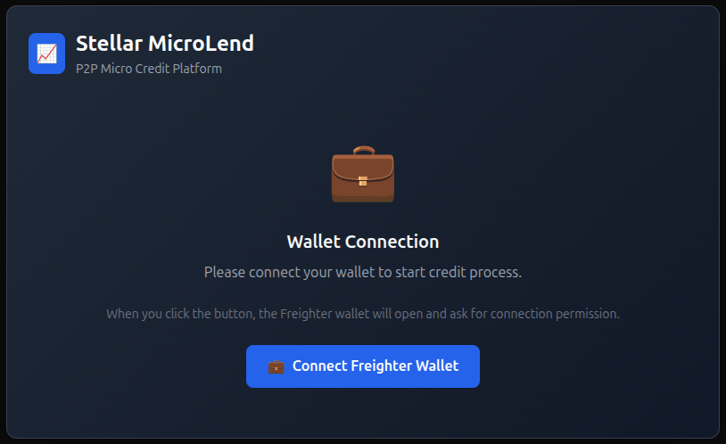
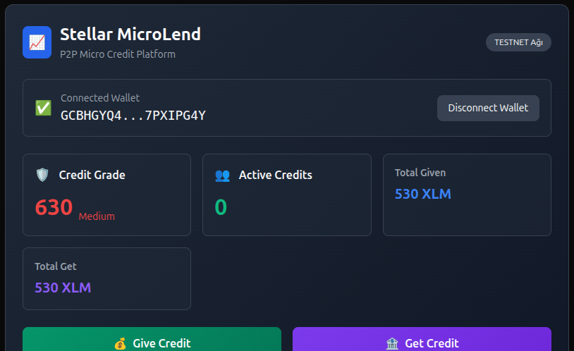

# 🏗️ Core Technologies

#### Frontend: 
<code> Next.js + React + Tailwind CSS </code>

#### Wallet Integration: 
<code> @stellar/freighter-api </code>

#### Smart Contracts: 
<code> Rust (Soroban SDK) </code>

# 🔑 How to Connect Your Wallet

#### 1- Install the Freighter Wallet Extension
#### 2- Open the app.
#### 3- Click on "Freighter Cüzdanını Bağla"
#### 4- Grant permission via Freighter.
<hr> 

#### You'll see a live mock-up of your:

- Wallet Address (shortened)

- Network

- Credit Score

- Lending / Borrowing Stats

# 🧪 Development
### 📦 Install dependencies
```bash
cd app
npm install
```
# 🚀 Run Next.js frontend

```bash
npm run dev
```

# 🛠️ Build & deploy Soroban contracts (optional)

```bash
cd contract
soroban build
```

# 📸 UI Snapshot



    

# 📌 Future Work

- ####   ✅ Real-time loan contracts

- ####   🔍 Credit analysis based on actual on-chain behavior

- ####   🌍 Deploy to Futurenet/Testnet

- ####   🧠 Use machine learning for credit scoring (as a service)

# 🔗 Links:
- 🌐 [Stellar Developer Docs](https://developers.stellar.org/docs/)
- 🔧 [Soroban Documentation](https://soroban.stellar.org/docs)
- 💼 [Freighter Wallet](https://freighter.app/)

<hr>

##### Built with ❤️ and 🤖 by Efe Yılmaz (Thorizodrago) for the Stellar AI Supported Project Development Workshop
